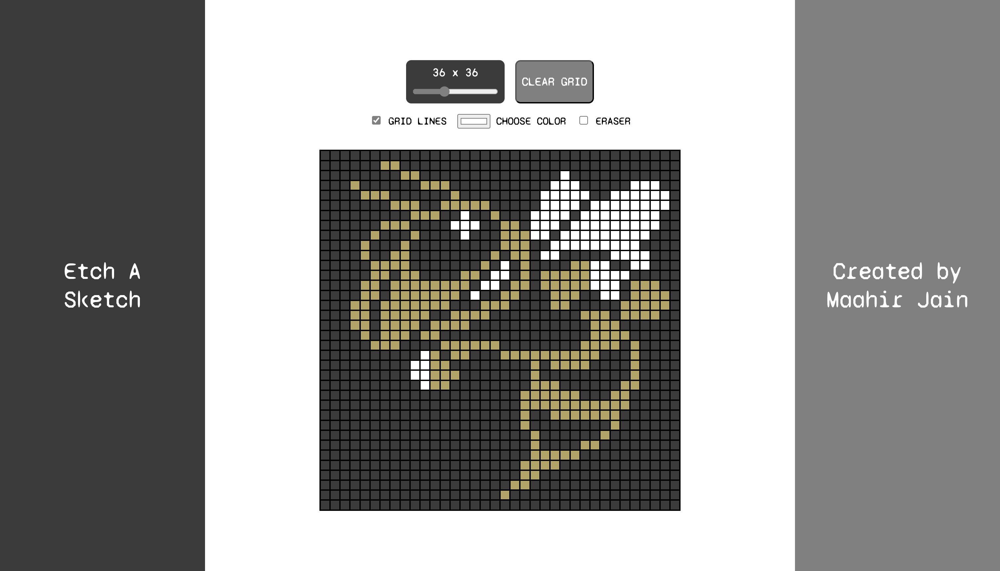
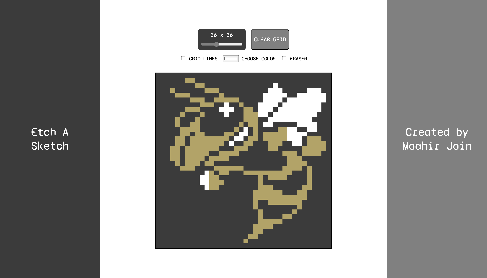

# Etch-a-Sketch

> “A painting is not a picture of an experience, but is the experience.” –Mark Rothko

A webpage I built to etch a sketch! 

The webpage's features include:
- Resizing the central grid to any square dimension between 1 x 1 and 100 x 100.
- Toggling on and off grid lines
- Changing the pen color using a color picker
- Activating the eraser
- Clearing the grid

The screenshots above portray a sketch of the incredible [Buzz](https://ramblinwreck.com/buzz/)!
